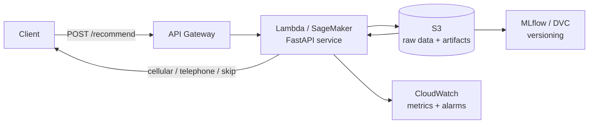

# datathon-8mlet-grupo-45

**Adaptive Offer-Experimentation Platform for Digital Banking** — Datathon 8MLET

A digital bank must decide, per eligible client, which **offer / message / next step**
to present across digital channels. Fixed rules and long A/B tests waste traffic, react
slowly to context changes, and make responsible personalization hard. This project builds
an **adaptive (multi-armed bandit) solution**: it identifies distinct client behaviors,
balances exploration and exploitation, and learns from observed conversions without
freezing the decision into static rules.

We replay the policy **offline** on a real marketing dataset and show that an adaptive
policy beats a deterministic baseline, then expose the learned recommendation as a small
HTTP service.

---

## Repository structure

```
datathon-8mlet-grupo-45/
├── README.md                       # problem vision, execution, golden set, cloud architecture
├── requirements.txt
├── data/
│   └── bank.csv                    # downloaded Kaggle/UCI dataset (45,211 rows)
├── notebooks/
│   ├── 01_eda_and_preparation.ipynb   # EDA, cleaning, feature prep, split
│   └── 02_baseline_and_bandit.ipynb   # baseline vs Thompson Sampling, metrics, golden set
├── src/
│   ├── features.py                 # load, clean (drop leakage), encode, split
│   ├── simulator.py                # LogisticRegression reward environment + channel lift
│   └── bandit.py                   # Contextual Thompson Sampling + deterministic baseline + recommend()
├── app.py                          # FastAPI (POST /recommend)
└── tests/
    └── test_golden_set.py          # Golden Set (5 client examples)
```

---

## Dataset

- **Kaggle base:** [`henriqueyamahata/bank-marketing`](https://www.kaggle.com/datasets/henriqueyamahata/bank-marketing)
- **Source / license:** the Kaggle base mirrors the **UCI Bank Marketing** dataset
  (Moro, Cortez & Rita, 2014) — the file `data/bank.csv` corresponds to `bank-full.csv`
  (45,211 clients, 17 columns), the same underlying data. Research use; attribution to
  the original authors and the Kaggle reference are preserved.
- **Target:** `y` = whether the client subscribed to a term deposit (≈11.7% conversion).
- **Leakage handled:** `duration` is dropped (mandated by the rubric — it is only known
  *after* the call), as are `day` / `month` (campaign period). `pdays` / `previous` /
  `poutcome` describe *previous* campaigns and are kept as client history but documented
  as a limitation. `contact` is the **action** the platform decides, not a client feature.
- **How to obtain it again:** `kaggle datasets download -d henriqueyamahata/bank-marketing`
  (place the CSV at `data/bank.csv`), or download the identical UCI `bank-full.csv`.

---

## How to run

```bash
# 1. dependencies
pip install -r requirements.txt

# 2. notebooks
jupyter notebook notebooks/ # or open the .ipynb in VS Code and run all cells

# 3. Golden Set tests
python -m pytest tests/ -q

# 4. service
uvicorn app:app --reload
```

Call the service:

```bash
curl -X POST http://127.0.0.1:8000/recommend \
  -H "Content-Type: application/json" \
  -d '{"age":34,"job":"management","marital":"married","education":"tertiary",
       "default":"no","housing":"yes","loan":"no","balance":2500,
       "campaign":1,"pdays":-1,"previous":1,"poutcome":"success"}'
```

Example response:

```json
{
  "recommended_offer": "cellular",
  "propensity": 0.5195,
  "segment": 2,
  "expected_reward": {"cellular": 0.6625, "telephone": 0.596, "skip": 0.0},
  "rationale": "p=0.52; 'cellular' has the highest expected reward net of cost (0.66 - 0.07) vs 'telephone' (0.60)."
}
```

---

## How it works

The logged data only shows the channel each client actually received, so to let a bandit
choose among offers we build a small **reward simulator**: a Logistic Regression fit on the
clean features predicts `P(convert | client)`, and the observed per-channel conversion
gives a channel **lift**. Expected reward per offer arm:

- `cellular` → `P(convert) · lift_cellular`
- `telephone` → `P(convert) · lift_telephone`
- `skip` → `0`

**Baseline (deterministic):** always present the `cellular` offer (best historical
channel) to every client.

**Adaptive policy — Contextual Thompson Sampling:** clients are bucketed into **3
propensity segments** (tertiles of `P(convert)`, fit on train only); each `(arm, segment)`
keeps a `Beta(1,1)` posterior. Per client we sample one conversion rate per arm from that
segment's posterior, subtract a **contact cost** (`0.07`) for contact arms (`skip` scores
0), and pick the arm with the highest score. The reward observed (from the simulator)
updates that `(arm, segment)` posterior. Exploration happens early; the policy then
exploits the best arm and learns to **skip low-propensity clients**.

### Results (eval split, 13,564 clients)

| Metric | Baseline (always cellular) | Contextual Thompson Sampling |
|---|---|---|
| Conversion (among contacted) | 14.7% | **17.2%** (+17.4%) |
| Contact rate | 100% | 73.9% (saves 26.1% of contacts) |
| Net value (conversions − cost·contacts) | 1,040.5 | 1,024.6 |

The adaptive policy converts the clients it *does* contact at a clearly higher rate while
contacting a quarter fewer clients (cost savings), at equivalent net value. With a higher
contact cost the net-value advantage of the adaptive policy grows.

---

## Golden Set — 5 client examples

| # | Client profile | Propensity | Recommended offer | Expected reward (cell / tel / skip) | Does it make sense? |
|---|---|---|---|---|---|
| 1 | Management, tertiary, previous success | 0.52 | `cellular` | 0.66 / 0.60 / 0 | High propensity → best offer |
| 2 | Blue-collar, secondary, unknown | 0.05 | `skip` | 0.07 / 0.06 / 0 | Expected reward < cost → skip |
| 3 | Retired, primary, previous failure | 0.11 | `cellular` | 0.13 / 0.12 / 0 | Marginal but positive → offer |
| 4 | Technician, secondary, previous success | 0.68 | `cellular` | 0.87 / 0.78 / 0 | High propensity → best offer |
| 5 | Services, secondary, unknown | 0.04 | `skip` | 0.05 / 0.05 / 0 | Lowest propensity → skip |

These 5 cases are encoded in `tests/test_golden_set.py` (valid arm, deterministic,
high-propensity contacted, lowest-propensity skipped).

---

## Cloud architecture



A simple deployment of this project on **AWS** would use a few managed services. The raw data, the trained simulator/bandit artifacts and the experiment metrics would live in **Amazon S3** (versioned buckets), so every model run is reproducible from a snapshot.

The FastAPI serving endpoint could be packaged as a container and hosted either with **Amazon SageMaker** (an inference endpoint with automatic scaling) or as **AWS Lambda + API Gateway** behind a small gateway, whichever is simpler to operate — both would load the latest artifact from S3 and answer `POST /recommend`. Logs, request/error/conversion metrics and the classic "armed bandit" exploration/exploitation telemetry would go to **Amazon CloudWatch**, which would also trigger alerts if conversion on any arm drops.

Finally, **MLflow** (or a lightweight equivalent) would record parameters and metrics per experiment, and **DVC** could keep the data and artifact versions linked to the code. This keeps the platform observable, reproducible and easy to revert.
